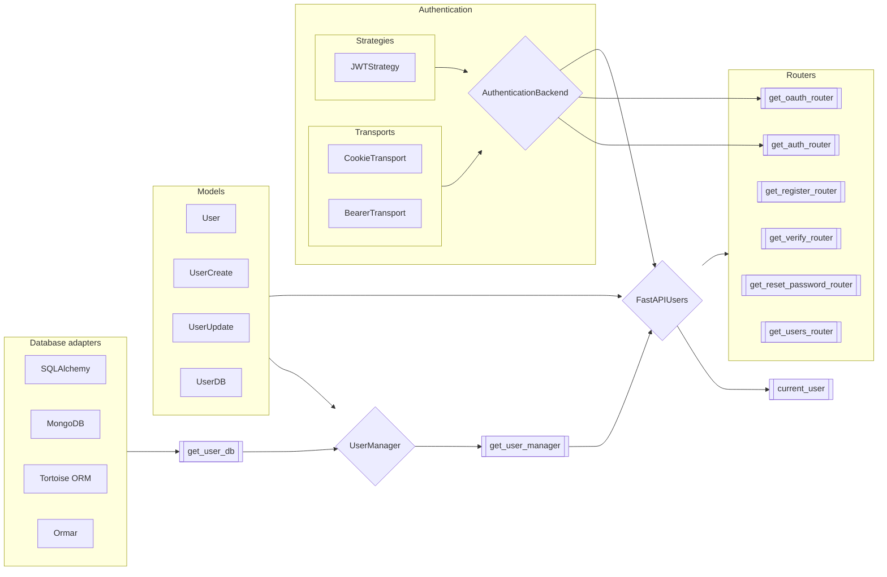

# Overview

The schema below shows you how the library is structured and how each part fit together.

## Models

Pydantic models representing the data structure of a user. Base classes are provided with the required fields to make authentication work. You should sub-class each of them and add your own fields there.

➡️ [Configure the models](./models.md)

## Database adapters

FastAPI Users is compatible with various databases and ORM. To build the interface between those database tools and the library, we provide database adapters classes that you need to instantiate and configure.

➡️ [I'm using SQLAlchemy](databases/sqlalchemy.md)

➡️ [I'm using MongoDB](databases/mongodb.md)

➡️ [I'm using Tortoise ORM](databases/tortoise.md)

➡️ [I'm using ormar](databases/ormar.md)

## Authentication backends

Authentication backends define the way users sessions are managed in your app, like access tokens or cookies.

They are composed of two parts: a **transport**, which is how the token will be carried over the requests (e.g. cookies, headers...) and a **strategy**, which is how the token will be generated and secured (e.g. a JWT, a token in database...).

➡️ [Configure the authentication backends](./authentication/index.md)

## `UserManager`

The `UserManager` object bears most of the logic of FastAPI Users: registration, verification, password reset... We provide a `BaseUserManager` with this common logic; which you should overload to define how to validate passwords or handle events.

This `UserManager` object should be provided through a FastAPI dependency, `get_user_manager`.

➡️ [Configure `UserManager`](./user-manager.md)

## `FastAPIUsers` and routers

Finally, `FastAPIUsers` object is the main class from which you'll be able to generate routers for classic routes like registration or login, but also get the `current_user` dependency factory to inject the authenticated user in your own routes.

➡️ [Configure `FastAPIUsers` and routers](./routers/index.md)
